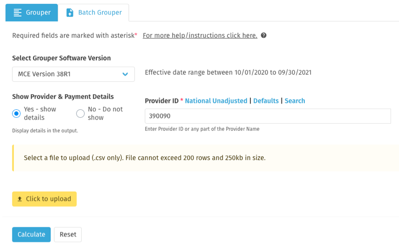
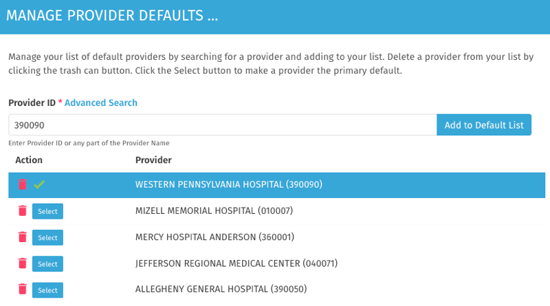

## MS-DRG User Guide
MediRegs provides an integrated MS-DRG Grouper & Calculator that  simulates MS-DRG grouping and payment under the Inpatient Prospective Payment System (IPPS). The MS-DRG Analyzer upgrade extends the Grouper & Calculator functionality  to allow for batch processing of coding data and deeper payment analysis. These tools are excellent companions to the codebooks, payment books, and the Code Explorer tool.

### Background Information
The MS-DRG Grouper utilizes ICD diagnosis and procedure codes to group into Medicare Severity Diagnostic Related Groups (MS-DRG) under the Medicare Inpatient Prospective Payment System (IPPS). The grouper logic is provided by the Centers for Medicare and Medicaid Services (CMS); the interface to that logic allows entry of a claim manually or with a batch upload and results are provided on screen or in downloadable format.

The MS-DRG Calculator & Analyzer performs a provider-specific calculation of the MS-DRG assigned. The calculator logic uses the IPPS Final Rule Table 5 for MS-DRG weights, and the CMS IPPS Final Rules and PC-Pricer for provider variables.

_Note: Depending on the level of access you have subscribed to, up to 5 to 10 years of archives are available._

#### Using the Integrated MS-DRG Grouper, Calculator, & Analyzer
When you first enter the calculator, you will have options based on your subscription level:
1. If you already know the MS-DRG codes, click on the Calculator link in the left menu for a simplified data entry panel.
2. If you want to group a single claim for which you have ICD diagnosis and procedure code, click on the Grouper link for a more detailed data entry panel.
Note: Users who have upgraded to the MS-DRG Analyzer also can group up to 200 claims at once using a simple .csv file upload feature.
3. If you want to perform more complex payment analyses, including outlier, state, county, per diem calculations or other comparisons, like between providers or discharge dates, click on the Analyzer link. 

### USING THE CALCULATOR TOOL

__To calculate payment by entering MS-DRG codes.__
If you already know the MS-DRG code(s), click on the Calculator link. The Calculator data entry panel allows you to enter Provider ID, Date of Service, and MS-DRG Code(s). Required fields are marked with a red asterisk. You can enter a single or multiple MS-DRG codes (separated by commas or spaces), and calculate the national unadjusted or provider-specific adjusted payment.

__Step-by-Step Instructions__

1. Enter the Provider ID by:
  1. Typing the name of the hospital in the Enter Provider ID box. As you type, notice auto-suggest options that you can click on;
  2. b. Click the National Unadjusted link above the entry box, if you want to calculate the national unadjusted rate; or,
  3. Click on Defaults above the entry box to use the default provider. How to set up default providers is explained later in this document. 
_TIP: Use the Search feature to identify a provider ID by Name, ID, Zip, State, City, County or Address. After entering your search term, select the appropriate provider._
1. Enter one or more MS-DRG(s) in the MS-DRG Code input box separated by commas or spaces. Click on the Search link to search by MDC or MS-DRG that auto-suggests based on your search. You can select a single code or a list of codes and have the option to either append or replace the selected code to the code input box.
1. Select the date of service, admit date to the discharge date, utilizing the calendar feature.
1. The Length of Stay will be automatically calculated, based on the date of service.
1. Apply COVID-19 Adjustment. This payment adjustment only applies to claims that have a discharge date after January 26, 2020. The default is No.
1. Apply Transfer Adjustment. Select no, short-term acute, or post-acute transfer. The default is No.
1. Click Calculate. Results appear on the screen. Results can be exported to PDF or XLS format by using the Export button above the Results.
1. Favorite the search parameters, via “Add to Favorites” to re-execute in the future.
1. To start over, click the Reset button to clear all entered values and results.

#### Output-Results

__Provider Information__
This summarizes how the hospital is generally paid, along with the dates of the stay.

__MS-DRG Payment Information__
You see the provider-specific payment rate for each MS-DRG, with the calculation broken down into detail.

The Results Summary lists payment information for the MS-DRGs entered in the input field. 
The Results Details tab will show the breakdown of the payment.
The Variables Used tab will display the values of the variables used in the payment calculation.
The Source Information tab will display all the values of the data sources and versions used in the payment calculation.

> Payment history for the MS-DRG is available by clicking the yellow button (Get History) on the Results Summary tab. You can view the data as a table or a bar graph.

### USING THE GROUPER TOOL

__To calculate payment by entering ICD-9 or ICD-10 codes__
To group and calculate the payment for a single claim utilizing ICD diagnosis and procedure codes, click on the Grouper link. The Grouper data entry panel allows you to enter Provider ID, Patient Information, Patient Stay Information, and ICD Codes. Required fields are marked with a red asterisk.

__Selecting the Grouper Software version__
The default will be the latest version of the Grouper software from CMS. You do have the option to select an older or newer version of the software. 

#### Step-by-Step Instructions

1. Select the radio button to show or not show provider details and payment details. 

1. If showing payment details, enter Provider ID by either
   1. Typing the name of the hospital in the Enter Provider ID box. As you type, notice auto-suggest options that you can click on;
   1. Click the National Unadjusted link above the entry box, if you want to calculate the national unadjusted rate; or,
   1. Click on Defaults above the entry box, to use the default provider. How to set up default providers is explained later in this document
1. If not showing provider and payment details, then in the calculation results the provider details and the payment details will be suppressed and it will only show grouping and edit logic.
1. Enter Patient & Stay Information.   
Select the date of service utilizing the calendar feature, the admit to discharge date.  Select the payor and discharge status.  Primary payor and discharge status are set to default values which can be changed using the drop-down menu.  Select the Date of Birth utilizing the calendar feature, Age at Discharge is calculated based on date of birth or can be entered, and Gender. 

1. Admitting Diagnosis and Principal Diagnosis are required. All other codes are optional. Select the Present On Admission indicator next to each code from the drop-down menu. Use the plus sign to add more codes. Enter procedure codes if applicable.
1. Click Calculate. Results appear on the screen.  Results can be exported to PDF or XLS format by using the Export buttons above the Results.
1. Favorite the search parameters, via “Add to Favorites” to re-execute in the future.
1. To start over, click the Reset button to clear all entered values and results.

**COVID-19 Adjustment** is automatically calculated in the payment based on the presence of specific ICD-10  codes and the discharge date being after January 26, 2020.  
The same rule will apply for the batch upload claims too.

**Transfer Adjustment** is automatically calculated in the payment based on the selected discharge status. The same rule will apply for the batch upload claims too.

### USING THE BATCH GROUPER TOOL

**To group and calculate payment based on a batch of claims** 
To group and calculate the payment for a set of claims for which you have ICD diagnosis and procedure codes, click on the Batch Grouper tab (this is only available when the Analyzer is purchased). The Grouper data entry panel allows you to enter Provider ID and then upload a properly formatted claims data file for batch processing. Instructions, sample claims, and a template file are available to download at the top of your screen (help link).

Before you begin, download the sample claim file (with or without detailed information). Save the file in CSV (XLSX is not supported). The file has detailed instructions and examples about how the data should be formatted. 

#### Step-by-Step Instructions

1. Select the radio button to show or not show provider details and payment details. Not showing means the calculation will be suppressed and just show grouping and edit logic.
1. If showing payment details, enter Provider ID by either.
  1. Typing the name of the hospital in the Enter Provider ID box. As you type, notice auto-suggest options that you can click on;
  1. Click the National Unadjusted link above the entry box, if you want to calculate the national unadjusted rate; or,
  1. Click on Defaults above the entry box, to use the default provider. How to set up default providers is explained later in this document.
1. Upload the file from your computer. 
Claims Data File (upload file) must be a .csv file.
The file cannot exceed 250kb which is approximately 200 rows.
1. Click Calculate. Results appear on the screen.  Results can be exported to PDF or XLS format by using the Export buttons above the Results.  When using the batch uploader, there are two XLS options: the first report shows the MS-DRG payment results, the second returns the same file entered with the MS-DRG and error notes columns appended to the right of your data.

#### Sample Files available for download for use in the Batch Uploader:

| File Name     |  Description |
| ----------------------- |:----------------:| 
| claims-sample.csv       | A file containing sample claims using ICD-9 codes. |
| claims-sample10.csv     | A file containing sample claims using ICD-10 codes.|
 
__On-Screen Results__
Your results screen will vary depending on whether you have used MS-DRGs or ICD codes, or if you have entered a single claim or multiple, or selected to hide payment information. The results screen keeps your search parameters at the top; scroll down for results.

The **Results Summary** lists payment information for one or more MS-DRGs depending on the input. It could show upto 200 MS-DRGs if you used the Upload feature with the Batch Grouper.

The **Results Details** tab will show the breakdown of the payment and display coding information.

The **Variables Used** tab will list all the values of the variables used in the payment calculation. Click on the appropriate link to see the details.

The **Source Information** tab will list all the values of the data sources and versions used in the payment calculation and Grouper. Click on the appropriate link to see the source information details.

**ICD Coding and Grouping Information** 
If you have provided ICD-CM codes, coding information and Medicare Code Edit messages may appear under **Grouper Details**.

### USING THE ANALYZER

#### ANALYZER: To analyze MS-DRG Payment and perform special calculations

This feature is available for subscribers who have upgraded to the MS-DRG Analyzer. To perform outlier, state, county, or other comparisons, click on the Analyzer link located on the left navigation pane. 
The Analyzer data entry panel allows you to enter Provider, State or County; an MS-DRG, Discharge date, Length of Stay, COVID-19 adjustment, transfer adjustment, Charges for Outlier calculation, and a multiplier. 

Please see the special instructions below for Provider/State/County Calculations.

**COVID-19 Adjustment** will apply to discharges after January 26, 2020.  It will show the payment adjustment attributed to COVID-19. 

**Special Payment Calculations available in the Analyzer**

**Outlier Payment Calculation:** When entering charges in the data entry panel, the Analyzer will check to see if the outlier threshold has been met and display the outlier payment if applicable.

**Payment based on Multiplier:** When entering a multiplier (any number greater than zero) in the data entry panel, the Analyzer will calculate expected payment based on the multiplier. Multiplier defaults to one (1) if not changed.

**State and County Average Calculation:** See more details below.

**Side-by-Side Payment Comparison & Benchmarking:** After running a calculation for a given payment scenario, click the Copy Last Column button, make changes to the scenario in the next column, and click analyze at the bottom of the new column. Alternatively, click the New Column button to add a new column. Select a column to be the BASE for the analysis and compare results; change the base by checking the box on a different column.

**Per Diem Calculation based on Length of Stay:** Enter any Length of Stay you wish. The results will show the per diem calculation based on the published GMLOS and the one you have entered. Length of stay defaults to 1 if not changed.

**Health Reform Impact Analysis:** This is calculated automatically for each column. The results will show the Medicare Expected Payment using the standard calculation, and then show the theoretical payment that would result without performance adjustments.

**Advanced Provider/State/County Search** 
The Analyzer has advanced capabilities to browse lists of facilities by state/county or to calculate state/county averages.

**Export Options** 
When exporting the results, select one column or all the columns listed on the screen. The CSV and PDF exports contain results as shown on screen.  The Pricer provides an export that is aligned to the CMS PC Pricer report.

**Common scenarios are detailed below:** 
| Scenario                         | Solution                                |
| ----------------------------------------- | ---------------------------- |
| To Calculate for a known provider     | Type the provider name/ID in the Provider input box, or click the search button and search by address |
| To Calculate National Unadjusted    | Enter the provider number “000000” (that is six zeroes) in the Provider input box, or click the National Unadjusted link near the provider box|
| To Calculate State Average | Enter the two-character initials (KY, MA) in the Provider input box; results will show how many providers are in the state, and that can be expanded to choose any provider from the list.|
| To search for a provider | Click on the Search button next to the Provider Input box. Select Search by Provider. Enter name or address information, click Search, and select the provider from the list.|
| To Calculate County Average | Click on the Search button next to the Provider Input Box. Select Search by County. Enter the two-character initials for the state in the State box. Choose the county from the drop-down menu and click SUBMIT.|

#### Modifying Provider Variables in the Analyzer

After running  a calculation, modify provider variables to run “what if” and other analyses. As you change variables, the calculated payment amounts automatically adjust. You can change any variable that appears with a blue dashed underline. After you’ve changed variables, they are highlighted and you can revert back to the original published value by clicking on the trash-can/delete icon displaying the original value.

**Creating Favorites** 
To save a session, scroll to the bottom of the column, and click ADD to Favorites, and provide a name. If variables were modified, that will be indicated. Once a Favorite is created, you will have the option at the top of the screen to Use Favorite and create a new column for analysis.

**Special Payment Analysis Information** 
The MS-DRG Analyzer results are presented in a simple table format. At the top, you will see basic Medicare Expected Payment Information, broken out by portions. Scroll down for additional details.

#### Detailed explanation of Analyzer Results Screen

**Provider Details:** Clicking on the blue icon next to the hospital name shows additional provider details.

**Outlier Calculations** 
In the Special Analysis section, the Analyzer automatically provides a calculation to determine if the payment scenario is eligible for an outlier payment based on the entered charges. The outlier payment is broken down by operating and capital portions and the impact on the total Medicare payment is shown.

**Per Diem Analysis** In the Special Analysis section, the Analyzer automatically provides a calculation that demonstrates the per diem based on the Geometric Mean Length of Stay (GMLOS) as published by CMS for the MS-DRG and the actual length of stay (LOS) entered.

**Multiplier Payment Adjustment** In the Special Analysis section, the Analyzer reflects multiplier impact to the Medicare Expected Payment by multiplying the calculated rate by for the entered multiple for calculating contract rates.

## COMMON FEATURES

**Setting up  and using the Default feature for Provider ID and MS-DRG** 
If there are Providers and MS-DRG codes utilized often, set them as defaults. Upon log in these defaults will auto-populate the Provider  ID field and the MS-DRG field.

Please note that defaults for Provider ID are available in the Calculator and the Grouper. The default for MS-DRG codes is only available in the Calculator.

Select the default by clicking the link above the Provider ID field and the MS-DRG Code field.
If more than one default is established, then a dropdown is shown. To manage the list of defaults, click the Manage defaults link.
*The same applies to the MS-DRG code as well.*

In the Manage defaults screen, search for a provider and to add it to the default list. Delete providers from the default list utilizing the trash can symbol. Select one to be the primary default provider; the primary default will be denoted with a green checkmark. (The same applies to the MS-DRG code defaults.) 

## Support

Please let us know if you have any questions, suggestions, or feature requests.

Submit a Ticket at <https://Support.MediRegs.com> 
Send an email to **Support@MediRegs.com** 
Call **1-800-808-6800**

[1]: https://google.com
